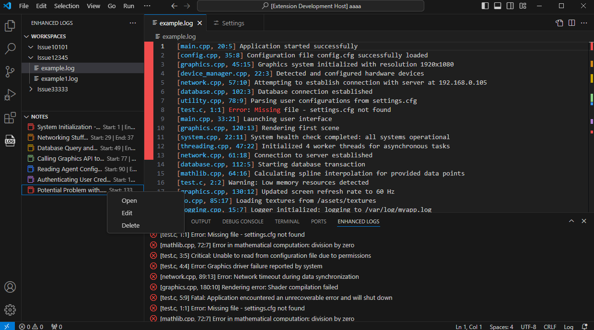
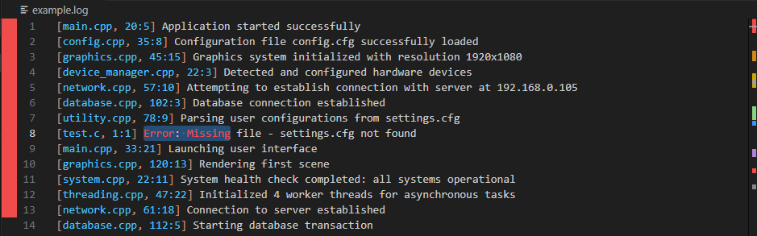

# EnhancedLogs

Enhanced Logs is a Visual Studio Code extension aimed at assisting developers in their debugging tasks. 

A common procedure to find a fix to a program issue is: gathering information about the problem, understading the steps that led to the unexpected behavior, and identifying the defective systems. This is heavily dependant on the use of log files, which is why EnhancedLogs provides features that add onto the already collected logs and makes them more useful and informative. Those features include:

- Color coded notes
- Parsing of potential error messages
- Workspaces
- Hover to get source code info
- Go To source file Definition/Implementation from a log message
- Peek Definition/Implementation directly in the log file
- Syntax Highlighting

## Features

### Colored Notes

#### Annotate your log files to keep track of important messages, document observations, section parts of the file, etc. 

> Create new notes by clicking on the `+` button in the **Notes** activity bar:

> Hover over a note to see its contents:

> Click on a note to jump to the saved location in the logs:

> Richt click on a note to Open, Edit, or Delete:

### Potential Problems Panel

#### Potential error messages are parsed and displayed in the bottom panel for more efficient debugging.

> Click on a message in the bottom panel to jump to its location in the logs:

### Workspaces

#### Use the workspaces panel to easily access log files

> Set up a workspace directory and access the files through the workspaces activity bar

### Source Hover

#### See the path, description and the lines of code that generated the message directly in the log file

> Hover over a source string to get information about files with matching file name

### Log Source Definition / Implementation Provider

#### Go To, Peek, and Find All Definitions / Implementations from a log file and easily see the source code of that outputted the log message

> Right click on a source string and select **Go To Definition**

> Right click on a source string and select **Peek Definition**

> Right click on a source string and select **Find All Implementations**

### Syntax Highlighting

#### A simple syntax highlighting implementation to differentiate source string information and common words that indicate potential problems

## Requirements

No requirements or dependencies for installation.

## Installation

EnhancedLogs can be installed through the GUI by following these steps:

1. Download `enhanced-logs-0.0.1.vsix`
2. Go to the **Extensions** view in your VS Code instance
3. Click **View and More Actions...**
3. Select **Install from VSIX...**

Alternatively, you can install the extension via the terminal:
1. Download `enhanced-logs-0.0.1.vsix`
2. Run `code --install-extension enhanced-logs-0.0.1.vsix`

## Configuration
#### Configure this extension by going to Settings > Extensions > EnhancedLogs
This extension contributes the following settings:

Workspace:
* `rootWorkspacesDirectory`: Path to root directory where log workspaces are located

Source Search:
* `rootSearchDirectory`: Path to root directory where source file search will be performed
* `sourceRegExp`: Regular expression used to match source info string in the logs
* `fileNameRegExp`: Regular expression used to match file name in the matched source string
* `filePositionRegExp`: Regular expression used to match file position in the matched source string

Hover Content: 
* `surroundingLineCount`: Number of lines to be displayed above and below the found source code line
* `maxMatchesForDetailedOutput`: Maximum number of matches to show detailed file output before resorting to compact output

Potential Problems:
* `errorRegExp`: Regular expression used to match potential error messages in log files

## Package Source

1. Clone the repository
2. Make sure that Node.js is installed
3. Run `npm install -g @vscode/vsce`
2. Change directory to the extension root directory
3. Run `vsce package`

## Release Notes

### 0.0.1

Initial release of EnhancedLogs

